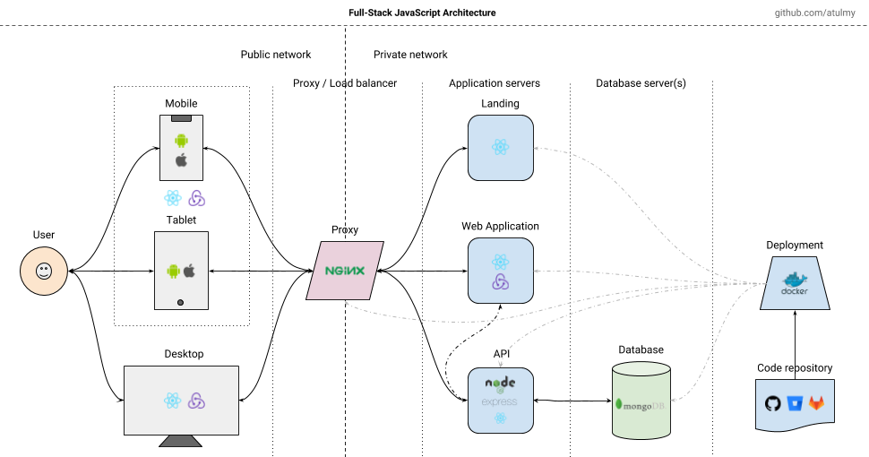

# hello-world
헬로월드입니다.
mark down language를 쓴다.
나무위키, 위키피디아.
#제목1
##작은 제목
### 더작은 제목

###설계도

###발표자료
###시연동영상
<iframe width="500" height="1035" src="https://www.youtube.com/embed/8DcrMJ4_7Uc?list=RD8DcrMJ4_7Uc" title="여름이니까 시원하고 청량한 노래로 기분 업☀️🌊 𝗦𝘂𝗺𝗺𝗲𝗿 𝗽𝗼𝗽" frameborder="0" allow="accelerometer; autoplay; clipboard-write; encrypted-media; gyroscope; picture-in-picture; web-share" referrerpolicy="strict-origin-when-cross-origin" allowfullscreen></iframe>

###referece
1. [네이버](https://www.naver.com)(br)
2. [구글](https://www.google.com)(br)

###개발자 소개
|제목|내용|설명|
|------|---|---|
|이름|백승진|   |
|기술|frondend|html,css,js,kotlin|
|   |backend|django, flask|
|   |database|oracle|
